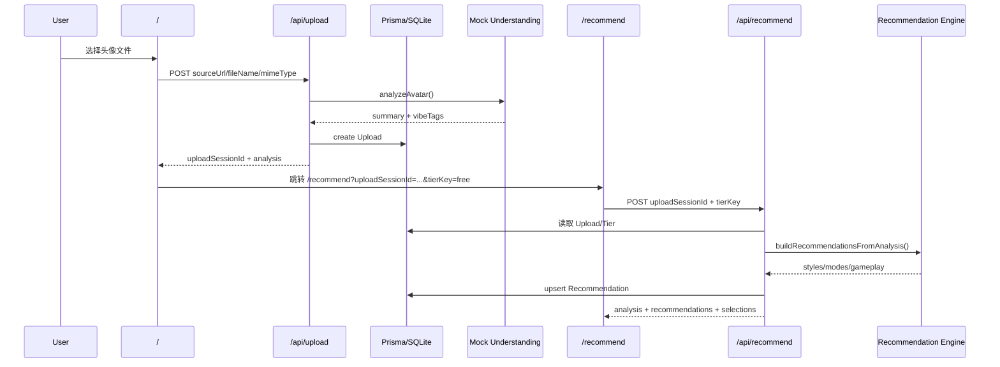
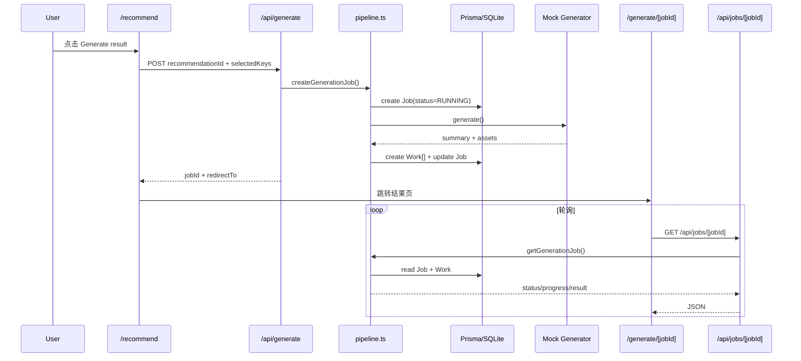

# Vibepix 系统架构文档

## 1. 项目定位

Vibepix 是一个 **Story Avatar Generator MVP**：
输入一张头像，系统先做角色气质分析，再生成一组故事化推荐（风格、叙事模式、玩法方向），最后启动一个 mocked 的生成任务，返回可展示的结果资产。

当前架构目标不是生产级 AI 出图平台，而是先验证以下闭环：
- 上传 -> 分析 -> 推荐 -> 选择 -> 生成 -> 展示
- 前后端协议是否稳定
- 数据模型是否能承接后续真实 AI provider、任务队列和后台配置

---

## 2. 总体架构

```mermaid
flowchart LR
    U[用户] --> H[首页 / 上传页]
    H --> UAPI[POST /api/upload]
    UAPI --> DB[(SQLite / Prisma)]
    UAPI --> IUP[Mock Image Understanding]

    H --> R[推荐页 /recommend]
    R --> RAPI[POST /api/recommend]
    R --> RPATCH[PATCH /api/recommend]
    RAPI --> ENG[Recommendation Engine]
    RAPI --> DB
    RPATCH --> DB

    R --> GAPI[POST /api/generate]
    GAPI --> PIPE[Generation Pipeline]
    PIPE --> DB
    PIPE --> MGEN[Mock Image Generation]

    G[结果页 /generate/[jobId]] --> JAPI[GET /api/jobs/[jobId]]
    JAPI --> PIPE
    JAPI --> DB
```

---

## 3. 分层说明

### 3.1 表现层（App Router 页面）

#### 页面路由
- `/`：首页，展示 Hero 和上传入口
- `/recommend`：推荐结果页，支持查看分析、切换推荐项、发起生成
- `/generate/[jobId]`：生成结果页，轮询任务状态并展示结果

#### 主要组件
- `src/components/home/hero.tsx`
- `src/components/upload/avatar-upload-form.tsx`
- `src/components/recommend/analysis-summary.tsx`
- `src/components/recommend/recommendation-strip.tsx`
- `src/components/generate/job-progress.tsx`
- `src/components/generate/result-viewer.tsx`

#### 前端职责
- 发起上传、推荐、生成、任务查询请求
- 管理页面状态：loading / ready / error
- 负责用户选择的即时反馈与错误提示
- 在结果页轮询任务状态

---

### 3.2 API 层（Route Handlers）

#### `POST /api/upload`
职责：
- 校验上传请求
- 调用图像理解 provider
- 创建 `Upload` 记录
- 落库 `analysisSummary` 和 `vibeTags`

输入：
- `fileName?`
- `mimeType?`
- `sourceUrl`

输出：
- `uploadSessionId`
- `analysis`

#### `POST /api/recommend`
职责：
- 按 `uploadSessionId + tierKey` 获取推荐上下文
- 读取/补全头像分析结果
- 调用推荐引擎生成 style / mode / gameplay 三组推荐
- upsert 一条 `Recommendation` 记录
- 纠正失效选择，返回当前已保存选择

#### `PATCH /api/recommend`
职责：
- 保存用户当前选择
- 保证选择只能来自当前推荐集

#### `POST /api/generate`
职责：
- 校验选择是否属于推荐集
- 更新推荐记录上的已选项
- 创建 `Job`
- 调用 orchestration pipeline 组装 prompt / result
- 写入 `Work` 结果资产
- 返回 jobId 和结果页跳转地址

#### `GET /api/jobs/[jobId]`
职责：
- 查询任务
- 根据创建时间和结果完整性，推进 RUNNING -> SUCCEEDED / FAILED
- 返回前端轮询所需的标准任务结果结构

---

### 3.3 领域与编排层

#### 推荐引擎 `src/lib/recommendation/engine.ts`
核心逻辑：
- 按 `vibeTags` 与 catalog tags 匹配打分
- 按 tier 过滤可用项
- 按 score + `sortOrder` 排序
- 每组取最多 3 个候选

输出三组推荐：
- `styles`
- `modes`
- `gameplay`

#### 生成编排 `src/lib/orchestration/*`
核心模块：
- `character-bible.ts`：把头像分析 + 用户选择压缩成角色设定摘要
- `prompt-compiler.ts`：把角色设定编译成 provider prompt
- `pipeline.ts`：串起推荐校验、panel 数量决策、任务写库、mock 生成、结果查询

#### panel 数量策略
当前由 `selectedModeKey` 决定：
- `single-scene` -> 1 panel
- `day-in-the-life` -> 最多 2 panel
- `mini-arc` -> 最多 3 panel（受 tier.maxPanels 限制）

---

### 3.4 Provider 抽象层

#### 图像理解
- 接口：`ImageUnderstandingProvider`
- 当前实现：`mock-image-understanding.ts`
- 当前规则：如果上传源信息包含 `dramatic`，返回更戏剧化标签，否则返回默认温和画像

#### 图像生成
- 当前实现：`mock-image-generation.ts`
- 输出：基于 jobId + selection 生成稳定的 SVG data URL
- 特点：
  - 可预测
  - 便于测试
  - 不依赖外部 AI 服务

这层已经具备抽象价值，后续可无缝替换为真实模型服务。

---

### 3.5 数据持久层

技术选型：
- Prisma 7
- SQLite
- `@prisma/adapter-better-sqlite3`

#### 核心实体

##### `Upload`
保存上传会话与头像分析结果。

##### `Tier`
定义套餐能力，如：
- `free`
- `plus`

##### `CatalogItem`
统一保存推荐候选项：
- STYLE
- MODE
- GAMEPLAY

##### `Recommendation`
绑定一次上传在某个 tier 下的推荐结果与用户选择。

##### `Job`
生成任务主表，保存状态、panel 数量、输出摘要。

##### `Work`
具体生成资产表，当前主要保存 PANEL 图。

##### 预留实体
- `PromptTemplate`
- `ModelRoute`

这两个表已经建模，但当前未真正接入生成流程配置。

---

## 4. 关键业务流

### 4.1 上传到推荐



### 4.2 推荐到生成结果



---

## 5. 目录结构

```text
src/
  app/
    api/
      upload/
      recommend/
      generate/
      jobs/[jobId]/
    generate/[jobId]/
    recommend/
    page.tsx
  components/
    home/
    upload/
    recommend/
    generate/
  lib/
    api.ts
    db.ts
    types.ts
    catalog/
    models/
    orchestration/
    recommendation/
    schemas/
prisma/
  schema.prisma
  db-push.ts
  seed.ts
tests/
  e2e/
  fixtures/
```

---

## 6. 当前架构特点

### 优点
- 前后端协议清晰，MVP 主流程已闭环
- provider、推荐、编排、展示边界比较清楚
- 数据模型已为后续套餐、Prompt、模型路由、作品资产扩展预留空间
- mock 生成是 deterministic 的，便于测试和回归验证

### 当前限制
- 不是异步任务系统，任务状态推进本质仍是本地模拟
- 没有对象存储，上传内容直接走 data URL
- 没有鉴权、配额扣减、用户体系、支付体系
- 真实模型路由与 prompt 配置表尚未接入
- 当前首页入口固定写死 `tierKey=free`

---

## 7. 后续推荐演进方向

### 短期
- 接入真实图像理解 / 生成 provider
- 把上传从 data URL 改成对象存储 URL
- 增加更多 E2E 和失败路径测试

### 中期
- 引入真正的异步任务队列
- 接入套餐、配额、鉴权
- 把 `CatalogItem`、`PromptTemplate`、`ModelRoute` 做成后台可配置

### 长期
- 支持真实作品管理、历史记录、再生成
- 支持多模型路由与 A/B prompt 策略
- 演进成可商用的 AI 角色故事生成平台
